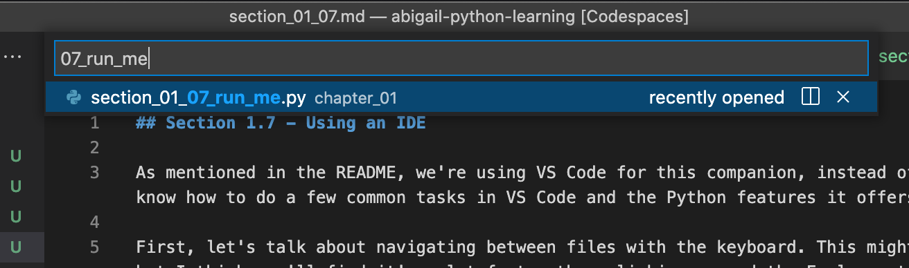
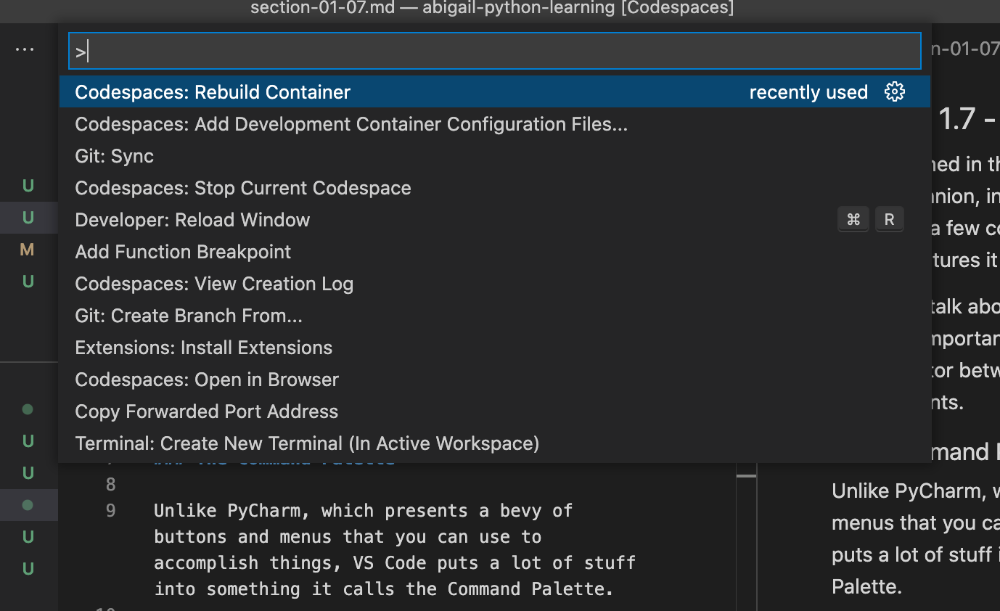
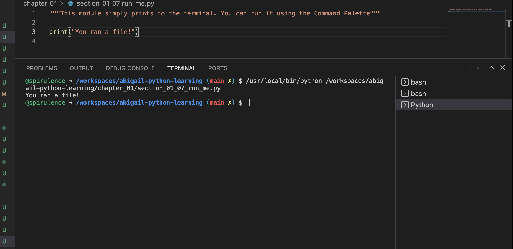

## Section 1.7 - Using an IDE

As mentioned in the README, we're using VS Code for this companion, instead of PyCharm. You'll want to know how to do a few common tasks in VS Code and the Python features it offers.

First, let's talk about navigating between files with the keyboard. This might feel unnatural at first, but I think you'll find it's a lot faster than clicking around the Explorer to get places in VS Code.

### Quick Open

You probably got to this file by clicking on it in the Explorer: that works, but a faster way would have been to press `COMMAND-P` and type some of the name of it. Try it out to open a file you'll need a bit later: press `COMMAND-P` or `CTRL-P` on Windows, and type `07_run_me`. You should see something like this:

Press `ENTER` to go to that file, or `ESC` to close the menu without leaving your current file.

Now, let's talk about the Command Palette. It's maybe the most important trick in VS Code and a key differentiator between it and other programming environments.

### The Command Palette

Unlike PyCharm, which presents a bevy of buttons and menus that you can use to accomplish things, VS Code puts a lot of stuff into something it calls the Command Palette.

Bring it up by pressing `COMMAND-SHIFT-P` on Mac, or `CTRL-SHIFT-P` on Windows.

A menu will pop up that looks a little like this: 

Your options might be different: that's okay! VS Code does it's best to learn what commands you run and display the ones it thinks you're likely to run, based on where you are in the application and what you've recently run.

Now for the slightly unintuitive part; you just start typing something close to what you want to run. Try out these commands that you'll use a lot with this companion resource:
 - `Python: Run Python File in Terminal`
 - `Markdown: Open Preview`

The Markdown command should do something (open a nicer view of this file), but the Python command won't work from this file, because this isn't a Python file.

You don't have to type the whole thing, nor do you have to start at the beginning. Typing `preview` is usually enough to get `Markdown: Open Preview` on the screen. If you get close enough, you can use the up and down arrow keys on your keyboard to highlight the right command. Press the `ENTER` key to run the highlighted command, and press `ESC` to exit the palette without running anything.

And now, about that `Run Python File in Terminal` command: you'll need to be in a Python file to get it to work. Navigate to `chapter_01/section_01_07_run_me.py` (preferably using Quick Open as above) and then run the same command. If you did it right, you'll see something like this:

That bottom panel can be hidden afterwards, too - either click the `X` or press `COMMAND-J` on your keyboard.

There will be more about VS Code later when you start writing larger programs with more rigorous testing procedures.
