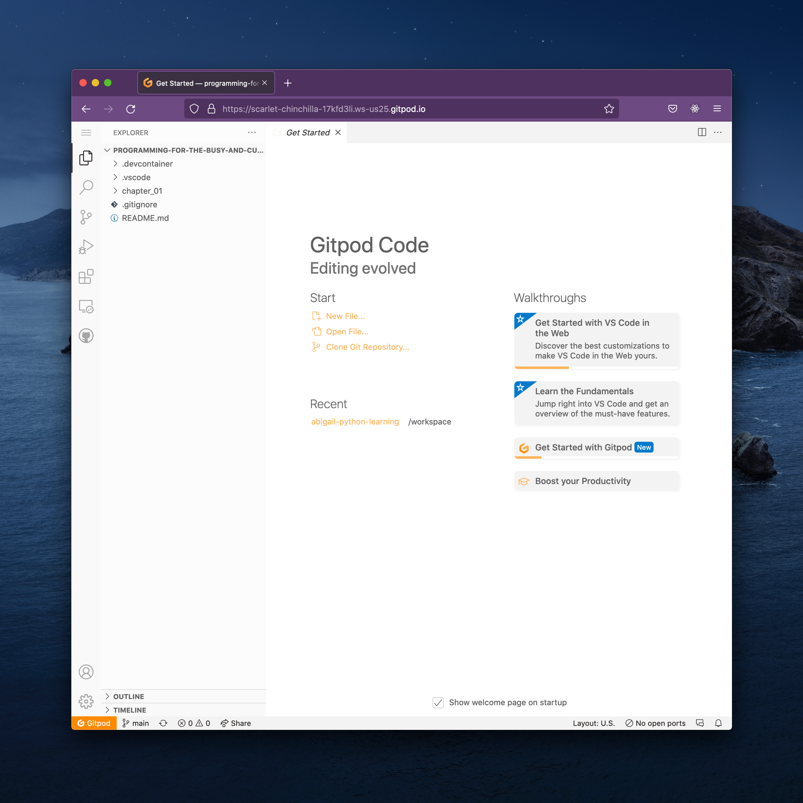

## Lesson 1: Up and running with GitPod

One of the things that continously bedevils even the most seasoned developers is getting the tools up and running. Sometimes the whole first tens of pages of a resource like this is dedicated to getting a programming language installed on your machine. Why do we expect folks with no experience to be able to do this?

We're going to sidestep a lot of those issues by using a service called GitPod that will host our tools for free on a computer somewhere else. You'll need a GitLab, GitHub, or Bitbucket account to sign in to GitPod. If you already have one of those accounts, you can skip to the section where we actually use GitPod.

### Registering with GitLab

Head over to GitLab to sign up: if you already have a Google, Twitter, or (less commonly) a Salesforce account, this process is very quick. Otherwise, you'll need an email address.

Go to https://gitlab.com/users/sign_up to register for GitLab, which looks like this:

I encourage you to sign in with Google, Twitter, or Salesforce if you can. One less password to remember (and to potentially be breached by bad guys).

Once that's complete, you're ready to use GitPod.

### Signing in to GitPod

Navigate to https://gitpod.io/#https://github.com/spirulence/programming-for-the-busy-and-curious to go to the GitPod page for this guide. You'll see a log-in page that looks like this:

Click on the sign-in button for the service you have an account with. You'll be taken to a page where you "authorize" GitPod to access your account. Here's what the GitLab page looks like:

You'll need to click on Authorize to proceed. GitHub and Bitbucket have similar pages, if you're using one of those instead.

After authorization, GitPod will present you with a status page that will go through several steps like "Creating" and "Pulling container image" without any intervention from you. This may take a few minutes, but eventually you'll get to a screen that looks like this:

You've done it! You've spun up a remotely available developer machine, with all the tools installed that you'll need for success.

Any time

